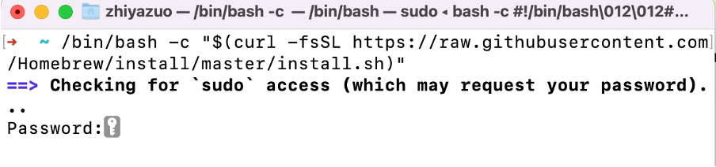

# Run a Web Application of a Fabric Test Network

_NOTE_: This is for IS6200: Blockchain Technology and Business Application @ CityU IS.

_Last updated: March 9th, 2023_

---

# Environtment Setup
## Using VirtualBox (recommended)
If you are using Windows or macOS with Intel chips, you are recommemded to download the Ubuntu dump [here](https://www.dropbox.com/s/uaczjtifqjmmwj9/Ubuntu%2018.ova?dl=0), which can later be imported to [VirtualBox](https://www.virtualbox.org/wiki/Downloads). The username and password are _is6200_ and _block_, respectively. With this, you are able to directly run a Fabric network following the tutorial materials. 

Below is a demo video for your reference:


## Configure on Your Own Laptop
The official website of Hyperledger Fabric provides [detailed instructions](https://hyperledger-fabric.readthedocs.io/en/release-2.4/install.html). You should start by installing the prerequisites and then the Fabric samples. As mentioned earlier, if you are using Windows or macOS with intel chips, you may want to use the Ubuntu virtual machine to save your time.

For those who are using MacBooks with Apple silicon (e.g., M1/M2 chips), you can refer to the following, which is a summary of the commands that you need to run: 

### Prerequisite

Before we are able to install fabric, we need to meet certain criteria by installing prerequisite software. To do this, we first install Homebrew, which is a software manager on macOS. We start by opening our terminal app (You can open it by using spotlight search) and run this line  (see the following screenshot):
```bash
/bin/bash -c "$(curl -fsSL https://raw.githubusercontent.com/Homebrew/install/master/install.sh)"
```



It would ask you to enter your password of this laptop. When you type,  nothing will show up (to protect your privacy). You just keep typing your password and hit “enter” key when you finish. It will proceed to the next step if the password is correct.
Once it’s done, you could double check if it’s installed properly by typing `brew --version` in the terminal:


Once it’s done, proceed to run ``brew install git curl go jq`` in the terminal:


Then wait for it to finish. Finally, we need to install docker with brew install --cask --appdir="/Applications" docker in the terminal:


After this, please open the docker app. It should be something like this:


### Install Fabric Samples
With the previous prerequisites being satisfied, we can proceed to install fabric.
First we will create a folder to store the materials. Run `mkdir -p $HOME/go/src/is6200` and `cd $HOME/go/src/is6200` in your terminal. You should now be seeing this if you run the command `pwd`. Note that you have a different username but the other parts of the path name is the same. 


Now, in this directory, run `curl -sSL https://bit.ly/2ysbOFE | bash -s -- 2.4.8 1.5.5` and it will start to install fabric and fabric samples in this directory. You are expected to see the following:


Now you can follow tutorial 3 materials to run your first fabric network!

# Run a Test Network
Before you can proceed, you may want to first run the following commands to see if the test network can start properly.

```bash
# Run the network:
./network.sh up

# Create a channel:
# `c1` is the channel name; you can change it to anything
# if you do not specify `-c c1`, the channel will be set to mychannel by default`
./network.sh createChannel -c c1

# Deploy smart contract as chaincode onto the channel:
# `-ccn` specifies the name of the deployed chaincode
# `-ccp` specifies the path of the source code of the smart contract
# `-ccl` specifies the programming language
./network.sh deployCC -c c1 -ccn cc1 -ccp ../asset-transfer-basic/chaincode-go -ccl go

# These `export` specify the binaries path and the fabric config path
export PATH="${PWD}/../bin:${PATH}"
export FABRIC_CFG_PATH="${PWD}/../config/"

# These `export` points to the identity docs 
# so that we can work as Org1
export CORE_PEER_TLS_ENABLED=true
export CORE_PEER_LOCALMSPID="Org1MSP"
export CORE_PEER_TLS_ROOTCERT_FILE=${PWD}/organizations/peerOrganizations/org1.example.com/peers/peer0.org1.example.com/tls/ca.crt
export CORE_PEER_MSPCONFIGPATH=${PWD}/organizations/peerOrganizations/org1.example.com/users/Admin@org1.example.com/msp
export CORE_PEER_ADDRESS=localhost:7051
```

Now we can go ahead to initialize the ledger:
```bash
# -C specifies the channel name
# -n specifies the chaincode name
peer chaincode invoke -o localhost:7050 --ordererTLSHostnameOverride orderer.example.com --tls --cafile "${PWD}/organizations/ordererOrganizations/example.com/orderers/orderer.example.com/msp/tlscacerts/tlsca.example.com-cert.pem" -C c1 -n cc1 --peerAddresses localhost:7051 --tlsRootCertFiles "${PWD}/organizations/peerOrganizations/org1.example.com/peers/peer0.org1.example.com/tls/ca.crt" --peerAddresses localhost:9051 --tlsRootCertFiles "${PWD}/organizations/peerOrganizations/org2.example.com/peers/peer0.org2.example.com/tls/ca.crt" -c '{"function":"InitLedger","Args":[]}'
```

You are expected to see something like this in the terminal (note that a status code of 200 indicates success):
```bash
2023-03-09 14:06:40.165 CST 0001 INFO [chaincodeCmd] chaincodeInvokeOrQuery -> Chaincode invoke successful. result: status:200
```

To confirm again, you could call the function `GetAllAssets` to double check:

```bash
# Check the assets added to the ledger:
peer chaincode query -C mychannel -n basic -c '{"Args":["GetAllAssets"]}'
```

The expected outcome is:
```bash
[{"AppraisedValue":300,"Color":"blue","ID":"asset1","Owner":"Tomoko","Size":5},{"AppraisedValue":400,"Color":"red","ID":"asset2","Owner":"Brad","Size":5},{"AppraisedValue":500,"Color":"green","ID":"asset3","Owner":"Jin Soo","Size":10},{"AppraisedValue":600,"Color":"yellow","ID":"asset4","Owner":"Max","Size":10},{"AppraisedValue":700,"Color":"black","ID":"asset5","Owner":"Adriana","Size":15},{"AppraisedValue":800,"Color":"white","ID":"asset6","Owner":"Michel","Size":15}]
```

Once you see these, your test network works well. You can proceed to shut down the network by running:

```bash
# Shut down the network:
./network.sh down
```

# Run a Web Application
To run a web application, first download the [files](https://github.com/zhiyzuo/IS6200-Web-App/tree/main/webapp). Note that the `clear.sh` file contains simple scripts to remove intermediary files. Run it after your shut down the Fabric network by `./clear.sh`.

Once you put these files into the `test-network/` folder and setup the network (use the command lines above and stop after you finish installing the chaincode), follow the commands below to build a binary of the web app:

```bash
# Clean up the files
./clear.sh
# Build the Go project
go mod init
go mod tidy
# Generate an executable binary
# `-o` specifies the filename 
# Here, it'd be `runweb`
go build -o runweb
# Runs the Go server
./runweb
```

Open the browser and type [localhost:3000](http://localhost:3000). You can expect the following page:

